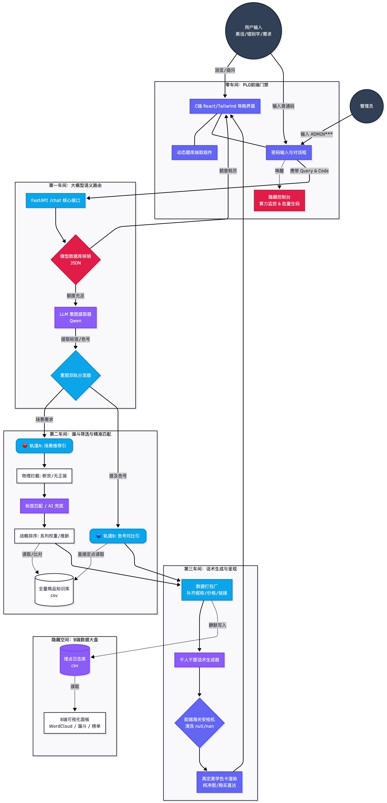

# ✨ 玖月 AI Beauty Advisor | 零售级大模型美妆导购引擎

<div align="center">

[](https://b23.tv/JxBpw2n)

*💡 提示：为获得最佳体验，请优先观看上方的高清实机演示视频。*

</div>

<div align="center">
  
  <p><em>▲ 基于双轨制路由的 AI 导购全链路可视化架构图</em></p>
</div>

<p align="center">
  
  
  
  
  
</p>

> **“不只是闲聊机器人，而是能真正扛起转化率的 AI 销冠。”**
> 
> 本项目是一个面向零售电商的 **SaaS 级智能导购解决方案**。通过独创的「大模型意图路由 + 物理规则校验」双轨制架构，彻底解决传统大模型在电商客服中“幻觉推荐、查无此货、答非所问”的致命痛点。

---

## 🎯 核心业务模块 (Core Modules)

### 🛍️ C端：高情商导购前台 (Consumer Interface)
* **精准意图分流**：引导用户在【场景推荐】（如：早八伪素颜）与【色号对比】（如：早泥豆沙 vs 走心番茄）两大高频场景中提问。
* **黑话与语病容错**：无缝解析野生消费者黑话，精准映射至官方标准 SKU，突破传统客服的关键词检索瓶颈。
* **所见即所得转化**：AI 话术生成后，自动渲染带有「匹配度」与「新品打标」的高级商品卡片及海报，极速缩短购买决策链路。

### 📊 B端：商业洞察与 RLHF 标注大盘 (Data Dashboard)
* **全局商业漏斗**：实时监控大盘调用量、意图分布转化率与 Top SKU 召回排行。
* **消费者原声金矿 (Word Cloud)**：动态提取无干预的真实用户检索词，为品牌企划与产品命名提供数据支撑。
* **RLHF 数据标注工作台**：首创双栏对比视图，对齐官方知识库基准，提供一键打标（✅ 合理 / ❌ 幻觉）功能，为后续构建高质量 Fine-tuning 微调数据集沉淀核心数据资产。

---

## 🏗️ 架构亮点 (Architectural Highlights)

1. **防幻觉双轨制 (Dual-Track Routing)**
   * **第一车间**：LLM 仅负责 NLU（自然语言理解）提取意图与标签。
   * **第二车间**：Pandas 接管本地物理知识库，进行硬匹配与库存校验（跳过断货商品）。
   * **第三车间**：LLM 结合真实的物理档案生成最终话术。
   * **成果**：实现 **100% 库存真实、0 幻觉推荐**。
2. **O(1) 边际扩展架构 (知识解耦)**
   彻底剥离“代码逻辑”与“业务数据”。只需替换底层的 CSV 数据字典，系统即可瞬间从“美妆导购”无缝泛化为“母婴导购”或“3C数码导购”。
3. **数据隔离与安全防护**
   项目采用严格的代码与商业数据解耦机制。开源仓库仅保留脱敏测试数据，真实商业知识库支持云端私有注入，保障核心资产绝对安全。

---

## 🚀 快速启动 (Quick Start)

> 🔒 **隐私声明**：为保护核心商业资产，本开源仓库默认不包含完整色号知识库与高清海报。系统将在启动时自动降级加载 `sample_knowledge.csv` 体验版数据。

### 1. 环境准备
```bash
# 克隆仓库
git clone [[https://github.com/jolie-zeng/jiuyue-ai-beauty-advisor.git](https://github.com/jolie-zeng/jiuyue-ai-beauty-advisor.git]
cd jiuyue-ai-beauty-advisor
