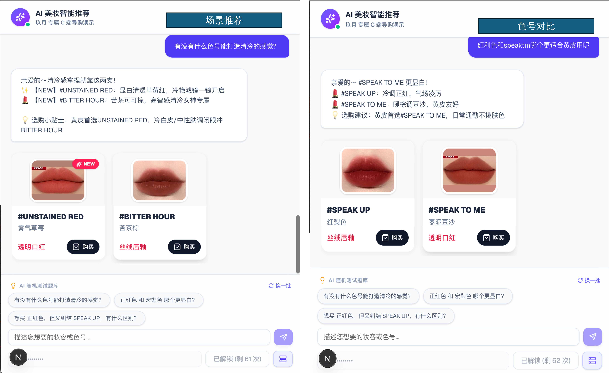
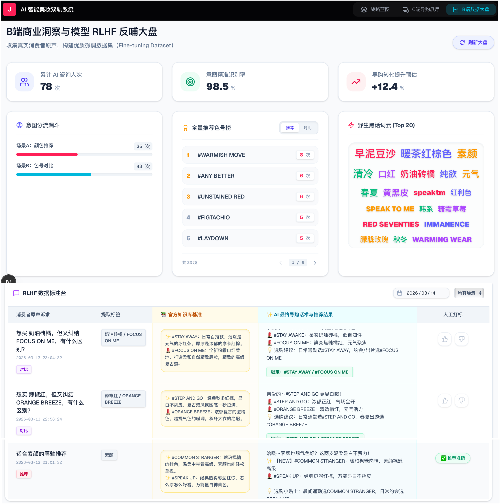

# ✨ 玖月 AI Beauty Advisor | 零售级大模型美妆导购引擎

<div align="center">

[](https://b23.tv/oeEBKsh)

*💡 提示：为获得最佳体验，请优先观看上方的高清实机演示视频。*


> 🚀 **在线体验 (Live Demo)**: [https://jiuyue-ai-beauty-advisor.vercel.app/](https://jiuyue-ai-beauty-advisor.vercel.app/)
> 
> 🔐 **系统门禁**：为保护底层大模型算力资产，本项目启用了邀测码机制。
> **请输入以下邀请码开启体验（每个邀请码10次体验机会）：OECYW1、6I9M90、ZGOFRD、XNFSLC、9PNADR、LFBPAZ、PT3HT0、17GPQX、B0B59P、YI0IP3**
> 
> *⚠️提示：本项目采用国际前沿的 Vercel + Render 云端部署架构。国内网络初次访问 API 可能存在唤醒延迟或无法访问。若遇网络阻断，建议开启VPN访问或强烈建议优先观看上方的高清实机演示大片。*

</div>

<div align="center">
  
  <p><em>▲ 基于双轨制路由的 AI 导购全链路可视化架构图</em></p>
</div>

<p align="center">
  
  
  
  
  
</p>

> **“不只是闲聊机器人，而是能真正扛起转化率的 AI 销冠。”**
> 
> 本项目是一个面向零售电商的 **SaaS 级智能导购解决方案**。通过独创的「大模型意图路由 + 物理规则校验」双轨制架构，彻底解决传统大模型在电商客服中“幻觉推荐、答非所问”的致命痛点。

---
<br/>

<div align="center">
  <table>
    <tr>
      <td width="33.3%"></td>
      <td width="33.3%"></td>
      <td width="33.3%"></td>
    </tr>
    <tr>
      <td align="center"><b>💬 C端：高情商导购体验</b><br/><sub>精准解码野生黑话，智能推荐高定色卡</sub></td>
      <td align="center"><b>🧠 三车间：核心推理引擎</b><br/><sub>可视化大模型思维链 (CoT) 与知识检索过程</sub></td>
      <td align="center"><b>📊 B端：RLHF 标注大盘</b><br/><sub>实时漏斗监控、原声词云与模型反哺台</sub></td>
    </tr>
  </table>
</div>

<br/>
## 👑 核心架构大纲：三车间双轨全链路
本项目采用创新的“流水线车间”架构，将大模型意图识别、推荐算法漏斗与前后端渲染无缝解耦，构建了一个支持 C端沉浸式导购与 B端数据回流的完整商业闭环。

### 🛡️ 零车间：PLG 门禁与算力资产保护 (Access Control)
为保护大模型算力资产，系统内置了轻量级 Product-Led Growth (PLG) 体验门禁：
* **🗄️ 微型算力数据库**：基于本地 JSON 构建轻量级密码本，实时核销 AI 算力调用次数。
* **🔐 权限分级机制**：
  * **C端体验客**：输入单次邀请码，解锁 10 次对话测试额度。
  * **超管隐藏通道 (`ADMIN***`)**：注入 100 次高阶算力。通过在前端 C 端输入框隐蔽唤醒“上帝视角”控制台，支持超管一键派发 20 个新体验码并便捷复制。

### 🧠 第一车间：大模型语义路由 (Intent Router)
告别传统的死板菜单，利用 LLM 进行自然语言的深层解析与分发：
* **🔍 意图解构**：无缝解析野生消费者黑话，提取原话中的核心关键要素：「场景标签」、「产品词」、「提及色号」。
* **🛤️ 智能双轨分流**：
  * **🔴 轨道 A (场景推荐)**：基于场景标签（如“早八通勤”、“黄黑皮”）自动进入多级推荐漏斗。
  * **🔵 轨道 B (色号对比)**：精准提取两个独立色号，跳过推荐引擎，直接进入 1v1 PK 链路。

### ⚙️ 第二车间：多级漏斗与引擎匹配 (Recommendation Engine)
将复杂的商业逻辑提炼为 5 级数据过滤漏斗，确保推荐结果既精准又符合业务导向：
* **📥 漏斗 1 - 物理拦截**：前置剔除「已断货」与「无正装售卖」的无效 SKU，保障转化率。
* **🎯 漏斗 2 - 精准框定**：根据用户提及的“唇泥”、“唇釉”等产品词，硬性锁定商品大类。
* **🏷️ 漏斗 3 - 语义命中**：通过矩阵计算商品自带场景标签与用户意图的重合度评分。
* **🤖 漏斗 4 - AI 兜底分流**：当常规标签全部失效时，唤醒 LLM 直接“阅读”官方推荐话术，进行强行语义同款召回。
* **📈 漏斗 5 - 战略权重与推新**：引入“品牌产品系列战略优先级”（如：丝绒唇釉 > 烟管口红）与“新品强推”机制。在基础评分相同的情况下，系统优先展示战略核心品与当季新品。

### 🎨 第三车间：话术生成与 C/B 端渲染 (Response & Render)
连接机器与用户的最后一公里，提供情绪价值与商业洞察：
* **💬 千人千面话术**：动态组装官方推荐话术与商品卖点，驱动 LLM 生成极具情绪价值的“金牌柜姐式”回复。
* **✨ 高定美学色卡 (C端)**：经过独特的“前端海关安检机”清洗冗余或 `NaN` 数据后，动态渲染极简长方形色卡卡片（集成英文色号、中文昵称、产品系列、新品角标及精准的购买跳转）。
* **📊 暗线埋点与大盘监控 (B端)**：将用户原话、AI回复、提取词、消耗码等数据隐形落盘至 `history_log.csv`。B端后台实时消费数据，生成意图漏斗图、高频场景词云，以及“推荐榜”与“对比榜”热度双榜单。

---

## 🎯 商业价值与技术亮点 (Business Value & Highlights)

* **防幻觉双轨制 (Zero-Hallucination)**：LLM 仅负责意图理解与话术生成，Pandas 接管本地物理知识库进行硬匹配与库存校验，实现 **100% 库存真实、0 幻觉推荐**。
* **O(1) 边际扩展架构 (知识解耦)**：彻底剥离“代码逻辑”与“业务数据”。只需替换底层的 CSV 数据字典，系统即可瞬间从“美妆导购”无缝泛化为“母婴”或“3C数码”导购。
* **消费者原声金矿 (Word Cloud)**：动态提取无干预的真实用户检索词，为品牌企划与产品命名提供数据支撑。
* **RLHF 数据标注工作台**：首创双栏对比视图，对齐官方知识库基准，提供一键打标（✅ 合理 / ❌ 幻觉）功能，为后续构建高质量 Fine-tuning 微调数据集沉淀核心数据资产。

---

## 🚀 快速启动 (Quick Start)

> 🔒 **隐私声明**：为保护核心商业资产，本开源仓库默认不包含完整色号知识库与高清海报。系统将在启动时自动降级加载 `sample_knowledge.csv` 体验版数据。

### 1. 环境准备
```bash
# 克隆仓库
git clone [https://github.com/jolie-zeng/jiuyue-ai-beauty-advisor.git](https://github.com/jolie-zeng/jiuyue-ai-beauty-advisor.git)
cd jiuyue-ai-beauty-advisor